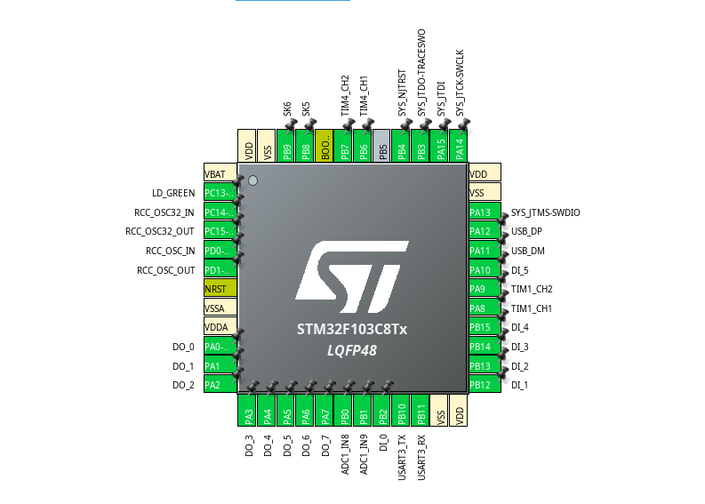

# K8032  
An STM32F103 Blue Pill-based clone of the Velleman K8055 USB interface card.

## K8055  
The K8055 from Velleman Inc. is a well-known USB interface card for PCs and has been available for over 20 years. A DLL for both 32-bit and 64-bit Windows can be downloaded from the Velleman website, allowing the card to be used with the GUI demo application or API.  
The K8032 communicates trough a 

## Features of the K8032  
- The K8032 operates at USB high device bus speed instead of low. Verify that resistor R10 on the Blue Pill is 1.5kΩ. If R10 is 10kΩ, connect a 1.8kΩ resistor between pin 1 (3.3V) and pin 12 (A12).  
- LD8 (DO_7) is not flashing after connecting to USB.
- The PWM frequency is 23.42kHz and is close to 23.43kHz, the K8055's PWM frequency.
- The Green board LED of the Blue Pill shows the USB connection status and USB activity.
- The K8032 has a serial debug interface for inspecting the incoming HID data packages.

To do:
- address selection
- PWM out
- analog in
- counter
- debounce function
- hardware board

## Pinout  


## Firmware

This firmware has been created with:

- STMCubeIDE version 1.17.0 and
- STM32CubeF1 Firmware Package V1.8.6

After (re)generating code with CubeMX, disgard the modified files below with git restore <file> or repair manually for custom HID.

```
Middlewares/ST/STM32_USB_Device_Library/Class/CustomHID/Inc/usbd_customhid.h
Middlewares/ST/STM32_USB_Device_Library/Class/CustomHID/Src/usbd_customhid.c
USB_DEVICE/App/usbd_custom_hid_if.c
USB_DEVICE/App/usbd_desc.c
USB_DEVICE/Target/usbd_conf.h
```

## Required hardware  
To function as a full replacement for the K8055 board, the STM32F103 Blue Pill requires additional circuitry, including:  

- An 8-line digital output buffer/level converter (3.3V to 5V).
- 5 lines of 5V-tolerant digital input buffers.
- Two low-pass filters for analog PWM outputs. 
- Two analog input amplifier/buffers.

**Important Note:** The STM32F103 Blue Pill operates with 3.3V logic I/O and accepts analog input voltages of 3.3V max.  

## Acknowledgments
Thanks to (Richard Hull)[https://github.com/rm-hull/k8055] for doing the reverse engineering of the K8055 HID packet protocol.
