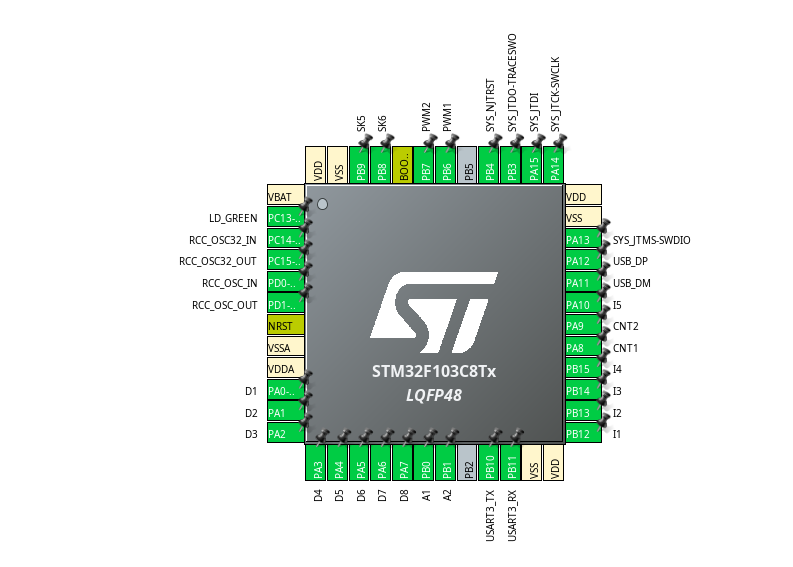
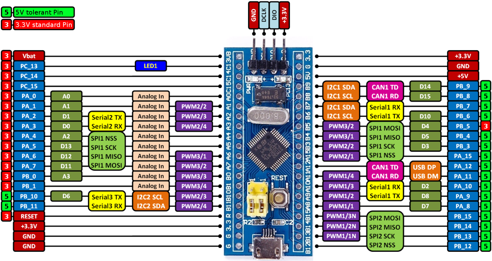

# K8032  

*This project mimics the Velleman K8055 USB interface card with the STM32F103 Blue Pill.*

## K8055  

The K8055 from Velleman Inc. is a well-known USB interface card for PCs and has been available for over 20 years. A DLL for both 32-bit and 64-bit Windows can be downloaded from the Velleman website, allowing the card to be used with the GUI demo application or API.
The K8055 communicates as a custom HID class device with two end points and uses 8-byte sized data packages.

## Features of the K8032  

- The K8032 connects as a high speed USB device instead of low speed. (Verify your Blue Pill. Resistor R10 should be valued 1.5kΩ. If R10 is 10kΩ, connect a 1.8kΩ resistor between pin 1 (3.3V) and pin 12 (A12).
- D7 digital output (K8055 - LD8) will not flash after connecting to USB
- The PWM frequency is 35.15kHz (23.43kHz for the K8055)
- The green (sometimes red or blue) LED connected to PC13 on the Blue Pill shows the USB connection status and USB activity
- The K8032 has a serial debug interface for inspecting the incoming HID data packages.
- The counter inputs no longer share the (digital) I1 and I2 inputs.
- Using 5V tolerant inputs for all digital and counter inputs.

To do:
- input filtering enabled on counter inputs
- moving average filter on ADC inputs.

## MCU pinout  



## Blue Pill pinout



## Firmware

This firmware has been created with:

- STMCubeIDE version 1.17.0 and
- STM32CubeF1 Firmware Package V1.8.6

After regenerating code with CubeMX, discard the replaced files below with `git restore` or repair manually for custom HID.

```
Middlewares/ST/STM32_USB_Device_Library/Class/CustomHID/Inc/usbd_customhid.h
Middlewares/ST/STM32_USB_Device_Library/Class/CustomHID/Src/usbd_customhid.c
USB_DEVICE/App/usbd_custom_hid_if.c
USB_DEVICE/App/usb_device.c
USB_DEVICE/App/usbd_desc.h
USB_DEVICE/App/usbd_desc.c
USB_DEVICE/Target/usbd_conf.h

```

## Required hardware  

To function as a full replacement for the K8055 board, the STM32F103 Blue Pill requires additional circuitry, including:

- An 8-way digital output buffer/level converter (3.3V to 5V).
- Five lines of 5V-tolerant digital input buffers.
- Two low-pass filters for analog PWM outputs.
- Two analog input amplifier/buffers.

**Important Note:** The STM32F103 Blue Pill operates on 3.3V and accepts analog input voltages of 3.3V max.

A PCB design for K8032 is planned...

## Flashing the STM32F103

Find the build firmware file in `firmware/`

## Connecting and operating the K8032

Don't forget to pull-down pins SK5, SK6 to select board address `0`.

## Acknowledgments

Thanks to [Richard Hull](https://github.com/rm-hull/k8055) for doing the reverse engineering of the K8055 HID packet protocol.
